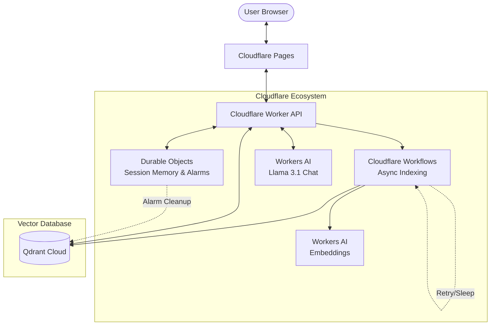

This repository contains a functional implementation of an AI Resume Advisor built on Cloudflare. The project leverages **Durable Object Alarms** for elegant session cleanup and **Cloudflare Workflows** for resilient RAG orchestration.

> [!IMPORTANT]
> For a deep dive into **Why Cloudflare** was chosen for each component, see [docs/architecture-design.md#architectural-rationales-why-cloudflare](docs/architecture-design.md#architectural-rationales-why-cloudflare).

## Architecture Overview




## Project Scope

Planned stack:

- Cloudflare Pages for frontend hosting
- Cloudflare Worker for API and real-time orchestration
- Durable Objects for session memory
- Cloudflare Workflows for async preprocessing
- Workers AI for embedding and generation
- Qdrant Cloud for vector retrieval

## Current Status

This repository contains a functional implementation of the AI Resume Advisor MVP.

### Implemented Features:

- **Frontend**: Vite React application with a premium glassmorphic UI, browser-side PDF extraction, and a 3-step onboarding wizard.
- **Backend (API)**: Cloudflare Worker with robust streaming chat, multi-turn conversation memory, and global error handling.
- **Session Management**: Durable Objects for persistent, per-session state and chat history.
- **Orchestration**: Cloudflare Workflows for background resume processing and automated RAG indexing.
- **LLM**: Integrated with Workers AI (Llama 3.1) for resume analysis and alignment feedback.
- **RAG (Retrieval-Augmented Generation)**: Full integration with Qdrant Cloud for vector search from both the user's resume and a curated knowledge base.
- **Knowledge Ingestion**: Recursive folder-based importer for markdown, text, and JSON guidance materials.
- **Stability**: Hardened error boundaries for Qdrant and LLM calls with automatic fallback to base context if services fail.

## Documentation

- [docs/architecture-design.md](docs/architecture-design.md)
- [PROMPTS.md](PROMPTS.md)

## Running Instructions

### Prerequisites:

- Node.js 20+
- npm 10+
- Qdrant Cloud account (or local instance)

### Setup:

1. Install dependencies:
   ```bash
   npm install
   ```
2. Create a `.env` file in the root directory (see `.env.example`).

### Development:

1. Run the frontend:
   ```bash
   npm run dev:frontend
   ```
2. Run the Worker in a separate terminal:
   ```bash
   npm run dev:worker
   ```

**Note**: The frontend runs on `http://localhost:5173` and proxies API requests to the Worker on `http://127.0.0.1:8788`.

### Knowledge Base Population:

To seed the AI with expert guidance:
```bash
npm run import:knowledge-folder
```
This recursively imports documents from the `knowledge materials` folder into your Qdrant instance.

## Deployment

1. **Worker**: `npm run deploy:worker` (requires Cloudflare login)
2. **Frontend**: Deploy to Cloudflare Pages via Git integration or `wrangler pages deploy`.

## Next Build Targets

1. Implement production-grade authentication (e.g., Cloudflare Access or Kinde).
2. Add comprehensive observability with Cloudflare Analytics or Baselime.
3. Enhance the "Alignment Score" with more granular breakdown metrics (ATS compatibility, keyword density).

- repository name should start with `cf_ai_`
- repository should include `README.md`
- repository should include `PROMPTS.md`
- README should contain real run instructions once code is added