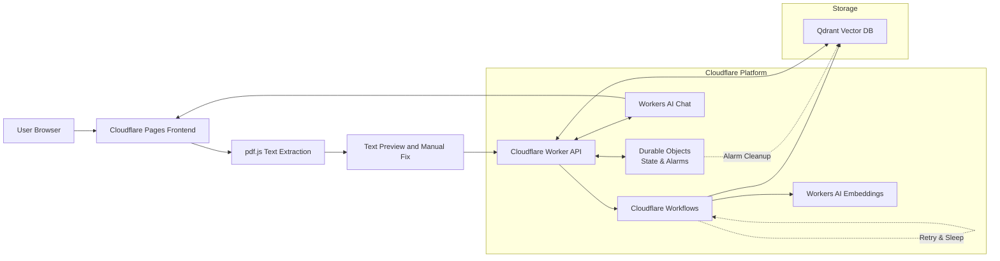

# AI Resume Advisor Architecture Design

## Project Goal

Build an AI Resume Advisor on Cloudflare that allows a user to upload a resume PDF, provide a target job description, and receive multi-turn AI suggestions for improving the resume.

The system should satisfy four core requirements:

1. LLM capability
2. Workflow or coordination capability
3. User input via chat
4. Memory or state across turns

## Proposed Stack

### Cloudflare Components

- Cloudflare Pages: frontend hosting
- Cloudflare Worker: API entrypoint and online request orchestration
- Durable Objects: per-session state and conversation memory
- Cloudflare Workflows: async preprocessing and indexing pipeline
- Workers AI: embedding model and chat model

### External Component

- Qdrant Cloud: vector database for curated knowledge and user resume chunks

## High-Level Architecture

### Frontend

The frontend runs on Cloudflare Pages and provides:

- A 3-step onboarding wizard:
  1. **Upload**: PDF upload and browser-side text extraction with `pdf.js`.
  2. **Review**: Extracted text preview and manual correction.
  3. **Target**: Job description input and session initialization.
- Multi-turn chat UI with a glassmorphic "Conversation-First" layout.
- Streaming display of AI responses with polished typography and micro-animations.

For the MVP, the frontend parses the PDF in the browser and sends extracted text to the Worker. This avoids relying on Node.js-native PDF libraries that do not run in the Cloudflare Worker runtime.

Because resume PDFs often use double-column layouts or visually complex formatting, the frontend shows the extracted text before analysis starts and allows the user to correct obvious parsing errors during the Review step.

### Worker API

The Worker is the online control plane. It should:

- Accept extracted resume text and chat messages.
- Normalize or clean resume text.
- Create and manage sessions.
- Handle session termination and cleanup coordination.
- Store and retrieve conversation history via **Durable Objects**.
- Trigger **Cloudflare Workflows** for async preprocessing (chunking, summary, indexing).
- Query **Qdrant** for retrieval-augmented generation (RAG).
- Assemble prompts with grounding rules and alignment scoring.
- Stream LLM output back to the browser.
- **Resilience**: Implement global error boundaries and service-level fallbacks (e.g., if Qdrant or AI is down, provide a base-text-only response).

## Resilience & Stability

The system is designed to be "fail-safe" for a smooth user experience:

1.  **Global Error Handling**: The `/api/chat` route captures all uncaught exceptions and returns a structured JSON error with a stack trace in development.
2.  **Qdrant Fallback**: All retrieval calls are wrapped in try-catch blocks. If Qdrant is unreachable or returns an error (e.g., 400/409 "already exists"), the system falls back to an empty context instead of crashing.
3.  **AI Binding Robustness**: The LLM service checks for the presence of the `AI` binding and catches model-specific errors, providing a deterministic "fallback reply" if the live model is unavailable.
4.  **Port Consistency**: During local development, the Worker is forced to `8788` (via `wrangler.toml`), and the Vite proxy is aligned to ensure stable connectivity.

### Durable Objects

Durable Objects store session-scoped state, including:

- parsed resume text
- optional structured resume summary
- job description
- conversation history
- retrieval readiness status

Durable Objects should not be used as a long-term file store.

They should remain the source of truth while retrieval is still pending, so the system can answer immediately even before vector indexing completes.

### Cloudflare Workflows

Cloudflare Workflows are used for background preprocessing, not for the main chat response path. They should handle:

- cleaning and chunking resume text
- generating embeddings
- upserting vectors into Qdrant
- generating a compact resume summary
- updating retrieval readiness

### Qdrant

Qdrant is used for retrieval, but collections must be separated by role to avoid contaminating retrieval quality.

Recommended collections:

1. `knowledge_base`
2. `user_resume_chunks`

The `knowledge_base` collection should only contain curated, high-quality content such as:

- strong resume examples
- high-quality JD templates
- resume writing guides
- domain-specific writing guidance

The collection can contain multiple source types for offline workflows, but the live chat path should only retrieve `resume_guide` content. `expert_resume` and `jd_template` documents may remain stored for later analysis, evaluation, or rewrite-template generation, but they should not be injected into the real-time comparison prompt.

The `user_resume_chunks` collection should contain only user-uploaded resume segments for the current analysis session.

Review-stage uploaded text should remain in Durable Objects until the user confirms or edits the extracted content. Only the confirmed resume text should be chunked, embedded, and written into `user_resume_chunks`.

### Vector Lifecycle and Cleanup

`user_resume_chunks` should be treated as short-lived session data, not permanent storage.

Recommended cleanup policy:

- attach `sessionId` and `expiresAt` metadata to each user resume chunk
- create a Qdrant payload index on `sessionId` for efficient delete-by-filter operations
- delete all vectors for a session when the session is explicitly ended
- when `SessionDO` expires, is manually deleted, or fires a cleanup alarm, issue a delete-by-filter request for that `sessionId`
- also delete all vectors older than 24 hours as a fallback policy
- run cleanup from a scheduled Worker job so Qdrant usage stays bounded on the free tier

Without this policy, each session would keep accumulating vectors and eventually exhaust Qdrant Cloud storage.

### Workers AI

Workers AI serves two jobs:

1. Embedding generation for retrieval
2. Chat generation for streaming resume suggestions

Because Workers AI may experience cold starts or model-specific rate limits, the Worker should implement bounded retry logic with backoff for transient failures and surface a clear fallback error to the UI when retries are exhausted.

Workflow steps that generate embeddings should also use retry or backoff behavior so temporary model failures do not permanently stall indexing.

## Visual Architecture



## Recommended Responsibility Split

### Online Request Path

Use the Worker for all real-time requests.

Path:

1. user sends message
2. Worker loads session state from Durable Objects
3. Worker queries Qdrant for relevant user resume chunks and curated knowledge
4. Worker assembles the final prompt
5. Worker calls Workers AI chat model
6. Worker streams the answer to the frontend
7. Worker persists the new messages to Durable Objects

### Async Background Path

Use Cloudflare Workflows for preprocessing.

Path:

1. user uploads resume PDF
2. Worker extracts text and initializes session state
3. Worker triggers a Workflow
4. Workflow chunks the resume text
5. Workflow creates embeddings
6. Workflow upserts vectors to Qdrant
7. Workflow writes summary and readiness state back to Durable Objects

This keeps chat latency lower and simplifies streaming.

### Pending Retrieval Behavior

Users may start chatting before the Workflow finishes indexing the resume.

If `retrievalStatus === "pending"`:

- skip Qdrant retrieval for that request
- answer using `resumeText`, `jobDescription`, and recent conversation history from Durable Objects
- surface a frontend notice such as: "Your resume is still being processed. The current answer is based on the full extracted text."

Once retrieval becomes `ready`, the Worker should resume the normal RAG path automatically.

## Why Curated and User Resumes Must Be Separated

If strong resumes and weak resumes are mixed in the same retrieval pool, the vector database will return semantically similar content without understanding quality. That degrades answer quality because poor writing can be retrieved as if it were a good reference.

To prevent this:

- store curated reference material separately from user resumes
- query them separately
- label them separately in the prompt

The model should see curated knowledge as guidance and user resume chunks as material to diagnose.

## Data Model

Suggested session state shape:

```ts
type SessionState = {
  sessionId: string;
  resumeText: string;
  resumeSummary?: string;
  jobDescription: string;
  messages: Array<{
    role: "user" | "assistant";
    content: string;
    createdAt: string;
  }>;
  retrievalStatus: "pending" | "ready" | "failed";
  resumeVectorIndexed: boolean;
  createdAt: string;
  updatedAt: string;
};
```

For the MVP, `resumeSummary` should be structured rather than free-form whenever possible. A compact JSON-like shape is easier to reuse across turns than sending the full resume text repeatedly.

Example summary shape:

```ts
type ResumeSummary = {
  targetRole?: string;
  yearsOfExperience?: number;
  coreSkills: string[];
  domainKeywords: string[];
  notableProjects: string[];
  gaps: string[];
};
```

Suggested Qdrant payload fields:

```ts
type RetrievalPayload = {
  source: "resume" | "knowledge";
  sourceType: "user_resume" | "expert_resume" | "resume_guide" | "jd_template";
  sessionId?: string;
  chunkType: "experience" | "skills" | "project" | "general_tip";
  qualityScore?: number;
  isCurated: boolean;
  text: string;
};
```

## Retrieval Strategy

For each chat request:

1. query `user_resume_chunks` with the current question
2. query `knowledge_base` with the current question and job description context, but only allow `resume_guide` results into the live chat path
3. merge the results with explicit role labels
4. pass both to the prompt builder

The two result groups should never be treated as interchangeable.

`expert_resume` and `jd_template` entries are intentionally excluded from live chat retrieval even if they exist in `knowledge_base`.

## Prompt Assembly

The final prompt should have stable sections:

1. system instruction
2. target job description
3. structured resume summary
4. relevant user resume chunks
5. relevant curated knowledge chunks
6. recent conversation history
7. latest user message

To avoid context overflow:

- summarize the resume once and reuse the structured summary
- prefer `resumeSummary` over raw `resumeText` once indexing is complete
- keep only the most recent conversation turns plus a running summary
- after roughly 5 conversation turns, summarize older turns and keep a sliding window of recent messages
- keep retrieval Top-K small

## API Design

### `POST /api/session/init`

Purpose:

- upload PDF and target JD
- create session
- initialize state
- trigger async preprocessing

Input:

- PDF file
- target job description

Output:

- `session_id`
- `status`

MVP note:

- the frontend uploads the PDF, extracts text with `pdf.js`, and sends the extracted text plus the original file metadata to the Worker

### `POST /api/chat`

Purpose:

- handle one user message
- retrieve context
- stream response

Input:

- `session_id`
- `message`

Output:

- streaming text response

### `GET /api/session/:id`

Purpose:

- inspect session readiness

Output:

- retrieval status
- message count
- resume presence indicator

### `POST /api/session/end`

Purpose:

- explicitly close a session
- trigger vector cleanup for that `session_id`
- reduce unnecessary Qdrant retention

Input:

- `session_id`

Output:

- `status`

## Suggested Module Split

Recommended top-level structure:

```txt
/apps/frontend
/apps/worker
/apps/worker/src/routes
/apps/worker/src/services
/apps/worker/src/durable-objects
/apps/worker/src/workflows
/packages/shared
```

Suggested worker modules:

- `routes/session.ts`
- `routes/chat.ts`
- `services/pdfService.ts`
- `services/qdrantService.ts`
- `services/llmService.ts`
- `services/promptService.ts`
- `durable-objects/SessionDO.ts`
- `workflows/resumeIngestWorkflow.ts`

Suggested shared modules:

- `types.ts`
- `promptBuilder.ts`
- `historyReducer.ts`
- `resumeFormatter.ts`

## MVP Delivery Order

Build in this order:

1. session creation, PDF upload, and browser-side text extraction
2. Durable Objects session memory with non-streaming chat on a fixed prompt
3. streaming chat from frontend to Worker
4. Cloudflare Workflows and Qdrant integration
5. prompt compression, retry, and observability

This sequence reduces integration risk, makes session state debuggable earlier, and avoids mixing streaming issues with document ingestion issues in the first implementation pass.

## Risks and Constraints

### PDF Parsing Risk

Resume PDFs often contain tables, multi-column layouts, icons, or scanned pages. A fallback path should exist for parse failures, such as allowing users to paste raw resume text.

Even when parsing succeeds technically, reading order may still be wrong. That is why the frontend preview-and-edit step is important for the MVP.

### Token Budget Risk

Resume text, job description, retrieved chunks, and multi-turn history can exceed context limits quickly. Summarization and message trimming are required.

The design should strongly prefer structured summaries plus a sliding conversation window instead of repeatedly sending the full resume text.

### Retrieval Quality Risk

Weak or noisy knowledge data will reduce answer quality. Curated content should be reviewed before being added to the knowledge collection.

### State Size Risk

Durable Objects should store session state, not large files or large retrieval caches.

### Model Availability Risk

Workers AI throughput and latency can vary by model and load. The system should tolerate transient failures with bounded retries and degrade clearly rather than hanging chat requests.

## Sequence Summary

1. Browser uploads a PDF and extracts text with `pdf.js`.
2. The frontend shows extracted text for review and optional correction.
3. The frontend sends normalized text and the target job description to `POST /api/session/init`.
4. The Worker creates or updates `SessionDO` state and triggers `resumeIngestWorkflow`.
5. The Workflow chunks the resume, generates embeddings through Workers AI, and upserts vectors into Qdrant.
6. The user sends a chat message through `POST /api/chat`.
7. If retrieval is still pending, the Worker answers from Durable Objects state only.
8. If retrieval is ready, the Worker loads Durable Objects state, queries Qdrant, calls the Workers AI chat model, and streams the answer back to the frontend.

## What This Is Not

This design is intentionally scoped as an MVP architecture.

It is not:

- a multi-tenant production platform
- a distributed document processing system
- a long-term document archive
- a fully hardened enterprise RAG platform with strict compliance boundaries

The goal is to deliver a working, reviewable Cloudflare-based AI Resume Advisor with clear state management, async preprocessing, and retrieval boundaries.

## Architectural Rationales: Why Cloudflare?

Choosing the Cloudflare stack was a strategic decision to leverage "elegant" infrastructure patterns that solve common RAG and state management problems:

### 1. Cloudflare Workers: High-Performance Streaming
- **Why**: Resume analysis is a long-running LLM task. Workers' native support for `ReadableStream` allows us to provide a "premium" UI experience by streaming AI feedback word-by-word, reducing perceived latency to zero.

### 2. Durable Objects: Elegant State & Alarms
- **Why**: RAG applications require a bridge between ephemeral chat and persistent vector stores. 
- **Elegant Feature**: **DO Alarms**. Instead of managing complex CRON jobs or external database cleanup scripts, we use `this.state.storage.setAlarm()` to automatically trigger Qdrant vector cleanup 24 hours after a session starts. This ensures zero data leakage and keeps our vector storage footprint minimal and self-managing.

### 3. Cloudflare Workflows: Resilient Preprocessing
- **Why**: Chunking, embedding, and indexing a resume is too heavy for a standard HTTP request and prone to transient failures.
- **Elegant Feature**: **Native Retries & Sleep**. Using `step.do` with exponential backoff ensures that if the AI embedding service or Qdrant Cloud is temporarily throttled, the ingestion won't fail. We also use `step.sleep` to demonstrate coordination—waiting for vector propagation before marking a session as `ready`.

### 4. Workers AI: Built-in Inference
- **Why**: By using `cf/meta/llama-3.1-8b-instruct`, we eliminate the need for external API keys and complex networking. The proximity of the model to our data (Durable Objects) minimizes the "hops" needed for a complete inference cycle.

## Current Recommendation

Use this architecture for the initial implementation:

- Pages for frontend
- Worker for online chat and streaming
- Durable Objects for session memory and **automated cleanup (Alarms)**
- Cloudflare Workflows for **resilient async indexing (Retries/Sleep)**
- Qdrant with separated collections
- Workers AI for embeddings and generation

This is the clearest path to a working MVP that still satisfies the project requirements.